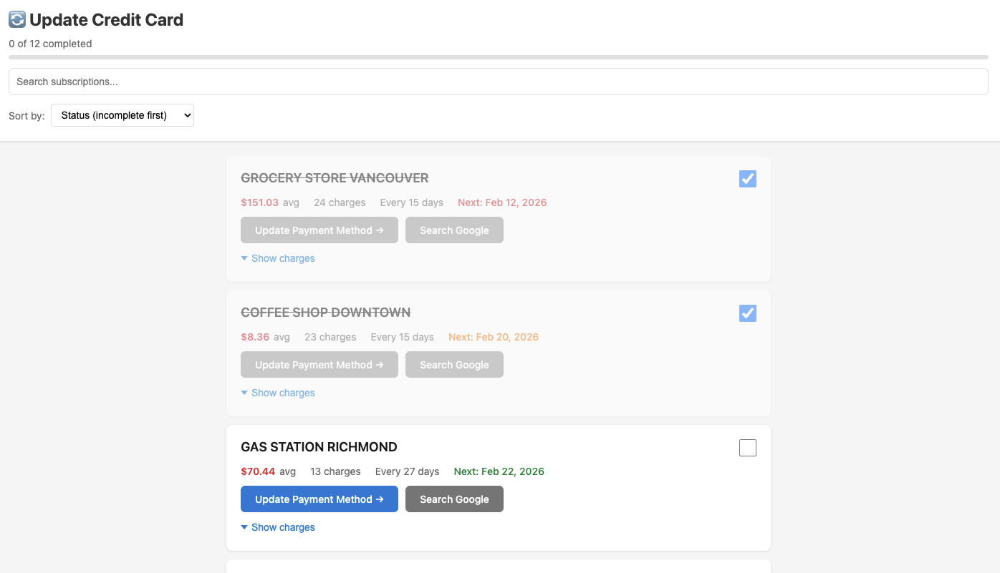

# Credit Card Subscription Updater

When your credit card expires or gets replaced, updating payment information across dozens of recurring subscriptions is tedious. This tool analyzes your credit card transaction history to identify all recurring charges and generates an interactive checklist to track your progress.



## Features

- **Automatic Detection**: Identifies recurring subscriptions (3+ charges) from transaction CSV
- **Smart Analysis**: Calculates average charge amounts and predicts next billing dates
- **Interactive Checklist**: Track progress with persistent checkboxes (saved in browser)
- **Search & Filter**: Quickly find specific subscriptions
- **Multiple Sort Options**: By status, amount, or next billing date
- **Direct Links**: Quick access to vendor billing pages (when available)
- **Transaction History**: View all charges for each subscription

## Quick Start

```bash
python3 generate_subscription_tracker.py transactions.csv output.html
```

Then open `output.html` in your browser and start checking off subscriptions as you update them.

## Input Format

Your CSV file should contain credit card transactions with these columns:

```
Account Type,Account Number,Transaction Date,Cheque Number,Description 1,Description 2,CAD$,USD$
```

- **Transaction Date**: Format `M/D/YYYY` (e.g., `1/15/2025`)
- **Amounts**: Negative values indicate charges
- **Currency**: Supports both CAD and USD columns

### Example CSV

```csv
Account Type,Account Number,Transaction Date,Cheque Number,Description 1,Description 2,CAD$,USD$
Visa,4532123456789012,1/5/2025,,NETFLIX.COM 866-579-7172,,-16.49,
Visa,4532123456789012,2/5/2025,,NETFLIX.COM 866-579-7172,,-16.49,
Visa,4532123456789012,3/5/2025,,NETFLIX.COM 866-579-7172,,-16.49,
```

## How It Works

1. **Parse Transactions**: Reads CSV and groups charges by merchant name
2. **Detect Patterns**: Identifies subscriptions with 3+ charges
3. **Calculate Metrics**: 
   - Average charge amount
   - Billing frequency (days between charges)
   - Predicted next billing date
4. **Generate HTML**: Creates interactive checklist with:
   - Color-coded urgency (red = due soon, orange = upcoming, green = later)
   - Persistent checkbox state (localStorage)
   - Progress tracking
   - Search and sort functionality

## Output

The generated HTML includes:

- **Progress Bar**: Visual completion tracking
- **Search Box**: Filter subscriptions by name
- **Sort Options**: 
  - Status (incomplete first)
  - Amount (high/low)
  - Next billing date (soon/later)
- **Subscription Cards**: Each showing:
  - Merchant name
  - Average charge amount
  - Next predicted billing date
  - Number of charges found
  - Link to update payment method
  - Expandable transaction history

## Sample Data

This repository includes sample data for testing:

- `sample-transactions.csv`: One year of fake credit card transactions
- `sample-recurring-subscriptions.html`: Generated output from sample data

**Note**: All sample data uses fake card numbers and generic merchant names for demonstration purposes.

## Use Cases

- **Card Expiration**: Update payment methods before your card expires
- **Card Replacement**: After fraud or loss, systematically update all subscriptions
- **Account Audit**: Review all recurring charges and cancel unwanted subscriptions
- **Budget Planning**: See all recurring expenses in one place

## Requirements

- Python 3.6+
- Standard library only (no external dependencies)
- Modern web browser for viewing HTML output

## Tips

- Export transactions covering at least 3-6 months for best results
- The tool detects charges appearing 3+ times as recurring
- Checkbox states persist in your browser (localStorage)
- Use search to quickly find specific services
- Sort by "Next billing (soonest first)" to prioritize urgent updates

## License

MIT License - feel free to use and modify as needed.
